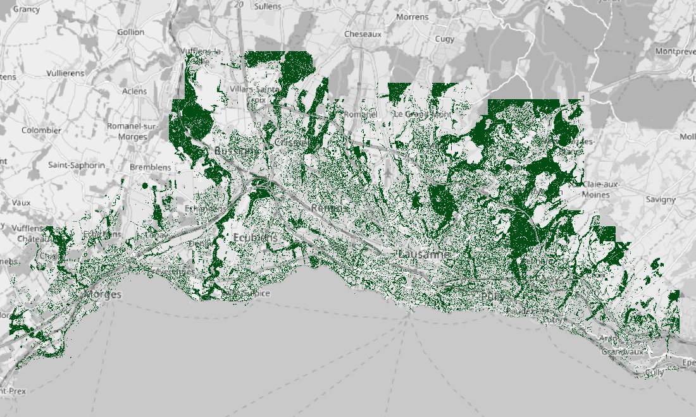

[](https://github.com/martibosch/lausanne-tree-canopy/blob/master/LICENSE)

# Lausanne tree canopy

Tree canopy map of Lausanne at the 1m resolution obtained with [DetecTree](https://github.com/martibosch/detectree) [1] from [SWISSIMAGE 2016](https://shop.swisstopo.admin.ch/en/products/images/ortho_images).



## Technical specifications

* **Source**: [SWISSIMAGE 2016](https://shop.swisstopo.admin.ch/en/products/images/ortho_images)
* **CRS**: CH1903+/LV95 -- Swiss CH1903+/LV95 ([EPSG:2056](https://epsg.io/2056))
* **Resolution**: 1m
* **Extent**: From file [agglom-extent.shp](https://github.com/martibosch/lausanne-tree-canopy/blob/master/data/raw/agglom-extent.shp). Obtained with the [Urban footprinter](https://github.com/martibosch/urban-footprinter). See the [lausanne-agglom-extent](https://github.com/martibosch/lausanne-agglom-extent) repository for more details.
* **Method**: supervised learning (AdaBoost) with 4 classifiers on manually-generated ground truth masks for 7 training tiles (out of a total 499 tiles) of 512x512 pixels. See Yang et al. [2] for more details.
* **Accuracy**: 91.75%, estimated from [a manually-generated ground truth mask for 1 tile of 512x512 pixels](https://github.com/martibosch/lausanne-tree-canopy/blob/master/data/interim/validation-tiles/tile_16384-2560.tif).

## Citation

If you use this dataset, the source, i.e., SWISSIMAGE 2016 *must* be acknowledged. Additionally, a citation to DetecTree would certainly be appreciated. Note that DetecTree is based on the methods of Yang et al. [2], therefore it seems fair to reference their work too. An example citation in an academic paper might read as follows:

> The tree canopy dataset for the agglomeration of Lausanne has been obtained from the SWISSIMAGE 2016 aerial imagery dataset with the Python library DetecTree (Bosch, 2020), which is based on the approach of Yang et al. (2009).

## Steps to reproduce

In order to reproduce this workflow, you need to have access to the SWISSIMAGE 2016 dataset, e.g., in [GeoVITe](https://geovite.ethz.ch). If so, you can download it for the following extent (in CH1903/LV03 coordinates):

```
E: 524843 546153
N: 148578 159128
```

and place it in the `data/raw/swissimage.tif` path of this repository.

### 1. Split SWISSIMAGE TIF into tiles

In order to obtain the train/test split of the dataset, the `data/raw/swissimage.tif` must be split into a set of tiles, which can be done as in:

```bash
make swissimage_tiles
```

The generated image tiles will be stored in the `data/interim/swissimage-tiles` directory.

### 2. Compute the train/test split

This step is optional, since this repository already includes [a CSV train/test split](https://github.com/martibosch/lausanne-tree-canopy/blob/master/data/interim/swissimage-tiles/split.csv). If you still want to generate your own train/test split, you might do so as in:

```bash
make swissimage_tiles
```

This will generate a CSV with the train/test split data frame at `data/interim/swissimage-tiles/split.csv`. Note that since train/test split uses a randomized k-Means algorithm, the generated CSV file will likely be different from the one commited in this repository. See the [detectree-example](https://github.com/martibosch/detectree-example) repository for more details.

### 3. Make the response tiles

The list of tiles for which a ground-truth mask must be provided manually can be obtained with Python as follows:

```python
import pandas as pd

split_df = pd.read_csv('path/to/split.csv', index_col=0)
split_df[split_df['train']]['img_filepath']
```

The ground truth masks can be generated by an image editing software such as [GIMP](https://www.gimp.org/), and must be saved in grayscale mode with the same file name to the `data/interim/response-tiles` directory.
**Note**: it is very important that the ground truth mask consists of two and only two pixel values. By default, DetecTree will process pixel values of 255 (white) as trees, and pixel values of 0 (black) as non-trees (although this can be customized by means of the [`tree_val` and `nontree_val` arguments of the `Classifier` class](https://detectree.readthedocs.io/en/latest/pixel_classification.html#detectree.Classifier). To ensure that the ground truth masks are well suited for DetecTree, you might use the following Python snippet:

```python
import numpy as np
import rasterio as rio

with rio.open("path/to/response-tile.tif") as src:
    print(np.unique(src.read()))
```

and ensure that it outputs only the tree and non-tree pixel values (e.g., 255 and 0 respectively).


### 4. Train the classifier (one for each cluster of tiles)

With the proper ground truth masks stored in the `data/interim/response-tiles` directory, the classifiers might be trained as follows:


```bash
make train_classifiers
```

which will train the classifiers and dump them the `models` directory.

### 5. Classify the tiles

In order to use the trained classifiers to detect the tree/non-tree pixels in the tiles, you can do:

```bash
make classify_tiles
```

which will classify the tiles at scale with [Dask](https://dask.org/) and dump them into `data/interim/classified-tiles`.

### 6. Mosaic the classified tiles into a single TIF file

You might assemble the classified tiles into a single TIF file as in:

```bash
make tree_canopy_map
```

which will dump the final output in `data/processed/tree-canopy.tif` in Swiss CH1903+/LV95 ([EPSG:2056](https://epsg.io/2056)). Note that all the TIF files except for the latter are in Swiss CH1903/LV03 coordinates ([EPSG:21781](https://epsg.io/21781)). See the [Makefile](https://github.com/martibosch/lausanne-tree-canopy/blob/master/Makefile.csv#L150-L157) for more details.

### 7. Validation

The produced tree canopy map will be validated by computing the classification accuracy in a randomly-sampled tile that has not been used for training, e.g.:

```python
import pandas as pd

split_df = pd.read_csv('path/to/split.csv', index_col=0)
split_df[~split_df['train']]['img_filepath'].sample(1)
```

which will output the path to a randomly-sampled tile. Like with the response tiles, a ground truth mask for such tile can be generated by an image editing software such as [GIMP](https://www.gimp.org/), and must be saved in grayscale mode with the same file name to the `data/interim/validation-tiles` directory. Then, the following command:

```bash
make confusion_df
```

will generate a confusion data frame with the proportion of tree and non-tree pixels that have been classified correctly. The trace of such confusion data frame corresponds to the estimated classification accuracy.

## Acknowledgments

* With the support of the École Polytechnique Fédérale de Lausanne (EPFL)
* Project based on the [cookiecutter data science project template](https://drivendata.github.io/cookiecutter-data-science). #cookiecutterdatascience

## References

1. Bosch, M. (2020). Detectree: Tree detection from aerial imagery in Python. Journal of Open Source  Software (under review).

2. Yang, L., Wu, X., Praun, E., & Ma, X. (2009). Tree detection from aerial imagery. In Proceedings of the 17th ACM SIGSPATIAL International Conference on Advances in Geographic Information Systems (pp. 131-137). ACM.
